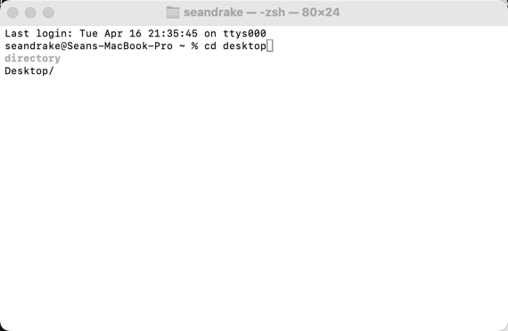
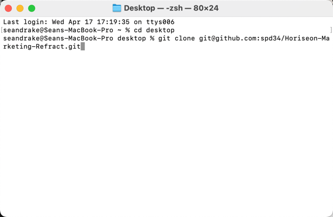
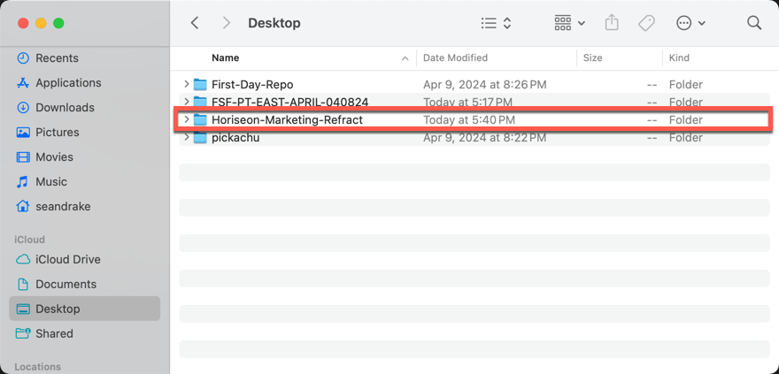

# Horiseon-Marketing-Refract

## Description

The purpose of this project was to look at a marketing agencies webpage and reformat the html.index and style.css file. One of the main process was refactoring the existing code to meet accessibility needs. An increasingly important consideration for businesses, web accessibility ensures that people with disabilities can access a website using assistive technologies like video captions, screen readers, and braille keyboards. Accessibility is good for business—for one thing, accessible sites rank higher in search engines like Google. It also helps companies avoid litigation, which might arise if people with disabilities can't access a website.

Refactoring is the process of restructuring code, while not changing its original functionality. The goal of refactoring is to improve internal code by making many small changes without altering the code's external behavior.

## Visual

## Installation

Open your terminal and enter CD DESKTOP - then press enter.

 Enter "git clone git@github.com:spd34/Horiseon-Marketing-Refract.git" then press enter

After hitting enter the repo will start downloading to your desktop where it can be opened with your code editor such as Visual Studio Code

